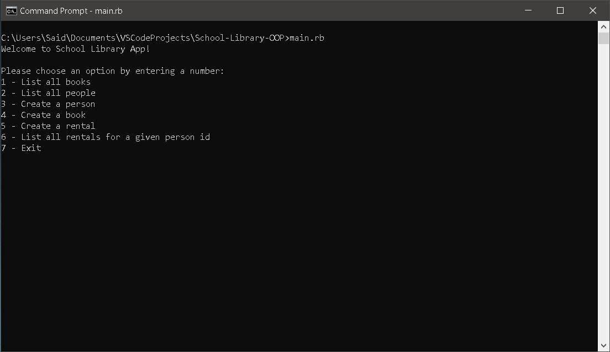

# School-Library-OOP

In this project I will create School Library app where you can: add new students or teachers, add new books, save records of who borrowed a given book and when. I will use UML class diagram and create entities presented by it. While I'm building this Ruby application I will be able to understand more deeply Object-Oriented Programming, Unit Tests (RSpec) and the "Decorator" design pattern.

## Screenshot

## Built With

- Ruby
- Gemfile
- Linters (Rubocop)
- VSCode
- Git Bash
- GitHub

<!-- ## Live Demo

[Netlify Live Demo Link](https://saidrasynl-tracker-covid-19.netlify.app/)
-->
## Getting Started

To get a local copy up and running follow these simple example steps.

### Prerequisites

- Laptop or Desktop
- Web Browser
- IDE (preferably Visual Studio Code)
- Programming Knowledge

### Setup

- Clone GitHub repository `gh repo clone SaidRasinlic/School-Library-OOP`
- (git) cd School-Library-OOP
- Open terminal and run the command *_$irb_* (Interactive Ruby Shell)
- Run the program functions, you are ready to start!

## Authors

👤 **Said Rasinlic**

- GitHub: [@GitHub/SaidRasinlic](https://github.com/SaidRasinlic)
- Twitter: [@Twitter/SaidRasinlic](https://twitter.com/SaidRasinlic)
- LinkedIn: [@LinkedIn/SaidRasinlic](https://www.linkedin.com/in/SaidRasinlic)

## 🤝 Contributing

Contributions, issues, and feature requests are welcome!

Feel free to check the [issues page](../../issues/).

## Show your support

Give a ⭐️ if you like this project!

## Acknowledgments

- Microverse 

## 📝 License

This project is [MIT](LICENSE) licensed.
